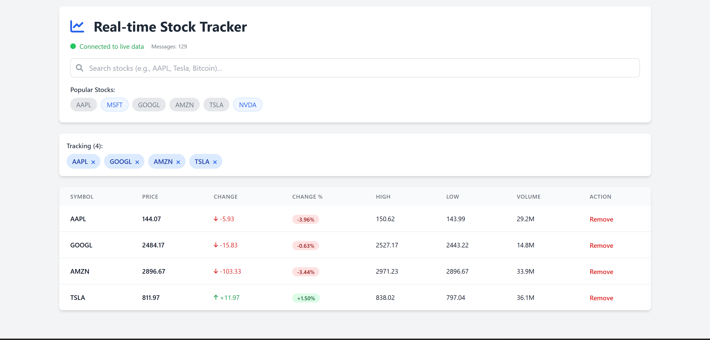

# Yahoo Finance WebSocket Code Analysis



## Overview
This Node.js application connects to Yahoo Finance's real-time streaming API to receive live market data for various financial instruments including stocks, cryptocurrencies, and other securities.

## Code Structure Analysis

### Dependencies
- **`isomorphic-ws`**: Universal WebSocket client that works in both Node.js and browser environments
- **`protobufjs`**: Protocol Buffers implementation for JavaScript to handle binary message serialization/deserialization

### Core Components

#### 1. Protocol Buffer Setup
```javascript
const root = protobuf.loadSync('./YPricingData.proto');
const Yaticker = root.lookupType("yaticker");
```
- Loads the protobuf schema from `YPricingData.proto`
- Creates a message type handler for `yaticker` messages

#### 2. WebSocket Connection
```javascript
const ws = new WebSocket('wss://streamer.finance.yahoo.com');
```
- Establishes secure WebSocket connection to Yahoo's streaming endpoint

#### 3. Event Handlers

**Connection Handler (`onopen`)**:
- Sends subscription message for multiple symbols
- Subscribes to: MSFT, GOOG, AAPL, TSLA, AMZN, BTC-USD, ETH-USD
- Uses JSON format for subscription requests

**Message Handler (`onmessage`)**:
- Receives binary protobuf messages
- Decodes using base64 buffer conversion
- Parses using the `yaticker` protobuf definition

## Protocol Buffer Schema Analysis

### Message Structure (`yaticker`)
The protobuf defines a comprehensive market data message with 33 fields:

#### Core Price Data
- `id` (string): Symbol identifier
- `price` (float): Current price
- `time` (sint64): Timestamp
- `currency` (string): Price currency
- `exchange` (string): Trading exchange

#### Market Data
- `changePercent` (float): Percentage change
- `change` (float): Absolute price change
- `dayHigh/dayLow` (float): Daily price range
- `openPrice` (float): Opening price
- `previousClose` (float): Previous session close
- `dayVolume` (sint64): Trading volume

#### Order Book Data
- `bid/ask` (float): Best bid/ask prices
- `bidSize/askSize` (sint64): Bid/ask quantities
- `lastSize` (sint64): Last trade size

#### Cryptocurrency Specific
- `vol_24hr` (sint64): 24-hour volume
- `volAllCurrencies` (sint64): Multi-currency volume
- `fromcurrency` (string): Base currency
- `circulatingSupply` (double): Circulating supply
- `marketcap` (double): Market capitalization

#### Options Data
- `strikePrice` (float): Strike price
- `expireDate` (sint64): Expiration date
- `underlyingSymbol` (string): Underlying asset
- `openInterest` (sint64): Open interest
- `optionsType` (enum): CALL or PUT
- `miniOption` (sint64): Mini option flag

### Enums

#### QuoteType
Defines 19 different instrument types:
- Basic: EQUITY, INDEX, ETF, BOND, FUTURE
- Advanced: OPTION, WARRANT, MUTUALFUND
- Crypto: CRYPTOCURRENCY
- Special: HEARTBEAT, INDICATOR, INDUSTRY

#### MarketHoursType
- PRE_MARKET, REGULAR_MARKET, POST_MARKET, EXTENDED_HOURS_MARKET

#### OptionType
- CALL, PUT

## Code Issues & Improvements

### 1. Deprecated Buffer Constructor
```javascript
// Current (deprecated)
new Buffer(data.data, 'base64')

// Should be
Buffer.from(data.data, 'base64')
```

### 2. Missing Error Handling
The code lacks error handling for:
- WebSocket connection failures
- Protobuf decoding errors
- Invalid message formats

### 3. No Reconnection Logic
Production applications should implement:
- Automatic reconnection on disconnect
- Exponential backoff
- Connection health monitoring

### 4. Hardcoded Symbols
Symbols are hardcoded rather than configurable

## Improved Version Example

```javascript
const WebSocket = require('isomorphic-ws');
const protobuf = require("protobufjs");

class YahooFinanceStream {
  constructor(symbols = []) {
    this.symbols = symbols;
    this.ws = null;
    this.reconnectAttempts = 0;
    this.maxReconnectAttempts = 5;
    this.reconnectDelay = 1000;
    
    this.initProtobuf();
  }
  
  async initProtobuf() {
    try {
      this.root = await protobuf.load('./YPricingData.proto');
      this.Yaticker = this.root.lookupType("yaticker");
    } catch (error) {
      console.error('Failed to load protobuf:', error);
    }
  }
  
  connect() {
    this.ws = new WebSocket('wss://streamer.finance.yahoo.com');
    
    this.ws.onopen = () => {
      console.log('Connected to Yahoo Finance stream');
      this.reconnectAttempts = 0;
      this.subscribe();
    };
    
    this.ws.onmessage = (data) => {
      try {
        const decoded = this.Yaticker.decode(Buffer.from(data.data, 'base64'));
        this.handleMessage(decoded);
      } catch (error) {
        console.error('Failed to decode message:', error);
      }
    };
    
    this.ws.onclose = () => {
      console.log('Disconnected from Yahoo Finance stream');
      this.handleReconnect();
    };
    
    this.ws.onerror = (error) => {
      console.error('WebSocket error:', error);
    };
  }
  
  subscribe() {
    if (this.ws && this.ws.readyState === WebSocket.OPEN) {
      this.ws.send(JSON.stringify({ subscribe: this.symbols }));
    }
  }
  
  handleMessage(data) {
    // Process the decoded message
    console.log(`${data.id}: $${data.price} (${data.changePercent}%)`);
  }
  
  handleReconnect() {
    if (this.reconnectAttempts < this.maxReconnectAttempts) {
      this.reconnectAttempts++;
      const delay = this.reconnectDelay * Math.pow(2, this.reconnectAttempts - 1);
      
      console.log(`Reconnecting in ${delay}ms (attempt ${this.reconnectAttempts})`);
      setTimeout(() => this.connect(), delay);
    } else {
      console.error('Max reconnection attempts reached');
    }
  }
}

// Usage
const stream = new YahooFinanceStream([
  'MSFT', 'GOOG', 'AAPL', 'TSLA', 'AMZN', 'BTC-USD', 'ETH-USD'
]);
stream.connect();
```

## Use Cases

This code is suitable for:
- Real-time trading dashboards
- Market monitoring applications
- Algorithmic trading systems
- Financial data analysis tools
- Cryptocurrency tracking apps

## Performance Considerations

- **Message Volume**: High-frequency symbols generate many messages
- **Memory Usage**: Consider message queuing for high-volume scenarios  
- **Processing**: Implement efficient data handlers to avoid blocking
- **Network**: Monitor connection stability and implement heartbeat checks